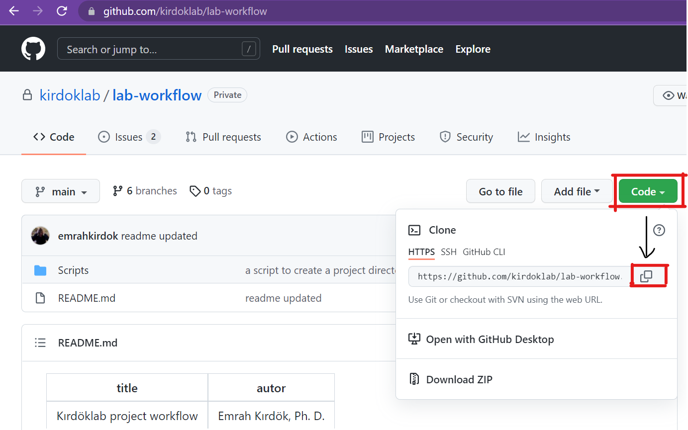
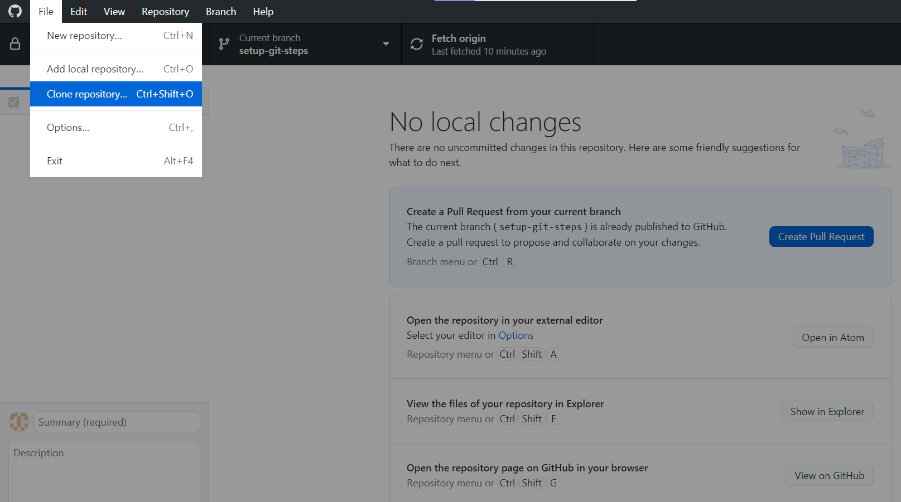
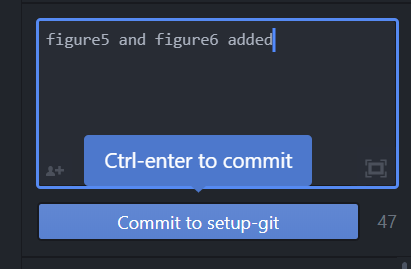
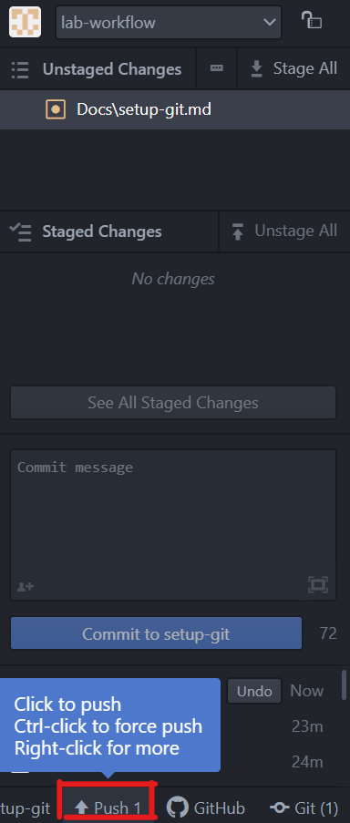

The purpose of this repository is to give a clear explanation on how we maintain our projects.

Essentially, we aim to follow these guideleines in this perspective:

+ Maintain a streamlined development procedure (A common understanding on the project folders)
+ Tracking development using `git` version controlling system
+ Creating a reproducible software environment using `conda` package controlling system
+ Maintaining reproducible research workflows using `snakemake` workflow system
+ Sharing our research via a container system (like `singularity`)

## The workflow, in essence

1. Every project in Kırdöklab start it's life with a project folder. We deposit all of our *data*, *scripts*, *results*, *documents* and *workflows* in this folder.
2. We track our development using `git` version controlling system and we develop our project in the `devel` branch.
4. The `main` branch is our product. We merge `devel` branch into `main`, once its mature enough to run.

Development system can be explained like this:

Every repository will habe a responsible person: The `main` branch contains the reproducible project and it is mainteined by this resposible member. For example, emrah is reponsible for this repo, and emrah is controlling the `main` branch. We merge our changes, once we are sure that the workflow is running.

We mostly work on `devel` branch is to develop the workflow. However, the members should not frequently commit to `devel`. Once we divide the work packages, every member should start working on their isolated branches.

For example, think that we held a meeting and divided the work packages to each member. This work packages will be divided in the issues section.

For example, a member is responsible for an issue and working on a feature update.

This member should create a new branch from the `devel` branch to fix this issue. For example the new branch can be called as `fix-feature` (change feature with the thing that you are working on).

Then, member will continue commiting on this branch, and frequently pushing these commits to the github repository for backup and purposes. Once the feature is fully working, the member will push the last commits to github, and asks for a pull request to the `devel` branch.

Then the person who is assigned to to this merge, will review the changes, and merges `fix-feature` branch into `devel`.

If the `devel` branch is in the mature state, the person who is responsible of the `main` branch, will merge the `devel` into `main`.

## Explanation of the folder structure

All of our projects should contain this folder structure:

+ `Data`
+ `Scripts`
+ `Results`
+ `Docs`
+ `workflows`

Please keep it consistent.

In additon, every project should contain these files:

+ `README.md`
+ `environment.txt` (if necessary)
+ `Snakefile` (if necessary)

`README.md` file generally explains the project, and describes using scripts, input files, and output files.

`Snakefile` is the file that we organise our workflow. Generally, we use `snakemake` workflow system to develop the pipeline. So, `Snakefile` is the file that we use. If we have one workflow, then we have one `Snakefile`. But we can have more workflow files if needed.

`environment.txt` file contains the packages for our project. Bioinformatic tools depend on different packages. Sometimes we need one speific version of these tools and packages. Frequently, we find ourselves in dependency conflits. So, we are creating isolated enviroments using `conda` package manager and we install our tools in an isolated enviroment.

Here is the folder structure we prefer to use:

**Data** folder contains the input data. We do not upload our data to GitHub. We generally share the data via GoogleDrive or Dropbox or other data sharing platforms (Zenodo).

**Scripts** folder contain all of the analysis scripts. These scripts must be commented and easlily readable.

**Results** folder contains the ouputs of these scripts.

**Docs:** The documentation information will go in this folder. Generally this folder will contain images, dot files and other supplenetary information. Also information related to papers, posters and reports will go here.

## Lab book

This repository is planned to be a lab book, that conaints everything that is needed to undestand the worklfow.

First, create the environment that is needed to compile the report.

```bash
mamba env create --file environment.yml
mamba activate workflow

```

Then, run the `snakemake` workflow like this:

```bash
snakemake -j1
```
# Our workflow

Our workflow starts with creating a repository. Generally, a user creates a repository on GitHub system. Then clones this repo to the local computer.

THe member then should create a `README.md` file in the `main` branch. This file should explain two things:

1. The overall aim of the project
2. Following steps
3. What will be the first version?

We keep the working version of our project in the `main` branch. So, we merge other branches into the main branch if we have a working version.

Member should commit this file and pushes to the GitHub.

## Creating the `devel` branch

We aim to develop our project in the `devel` branch. But members should not commit in this branch. In our weekly meetings, we decide on the ideas that will be added in the project. So, each member will create a branch that will seperate these ideas in several branches. With this way, we aim to minimise merge conflicts.

> If our project is a book, then branches are the ideas. And commits are the paragraphs.

## Developing ideas in a branch

After our meeting, we seperate the work packages. Members then start from this point. To create a new branch, members can follow this bullet points:

+ Pulling the latest state of the `devel` branch
+ Creating a new branch based on this point
+ Developing the ideas as commits
+ Sending a pull request to merge the idea into the `devel` branch

The person who is responsible on the pull request will review the changes and confirm the merge process.

## The flowchart of the process

The following flowchart can summarise this workflow:


# How to Set Up Git

This document contains the necessary information to set up and work on the Git system.

This document consists of the following titles:

1. What is Github and how to install it?
2. What is Repository?
3. How to clone a repository to computer?
4. How to create a new branch and delete the branch?
5. How to commit the changes made to files? 
6. How to push the changed files? 
7. How to pull the changes found in Github to computer?

## 1. What is Github and how to install it?

Git and Gİthub are different applications. Git tracks changes made in text files and store these changes in a data structure. 

Github on the other hand, is the platform where these changes are kept over the internet. Github must be installed to use this platform.

To install Github, the website [GitHub website] is accessed from (https://desktop.github.com/)

Github can be accessed through  'Atom'. To install this program the website [Atom website] is accessed from (https://atom.io/).

## 2. What is Repository?

The files of the project are stored in the repository. Every document related to the project is stored here.

to start a new project, the steps starting from 'Create a repository' or 'Open a Project' are followed on Github.  

## 3. How to clone a repository to computer?

To save a repository opened on Github to the computer cloning is done. 

+ Open this repository on Github and copy the link from the  ‘Code’ section.



+ Cloning is done by pasting the link from the ‘clone repository’ in the ‘file’ section of Github desktop. 




It is important to know to which file it is cloned. Because all the files of the project will be saved in this folder.  After this process, the repository will be cloned to the computer. 

## 4. How to create a new branch and delete the branch?

There are different branches in Github, such as 'main' and 'devel'.The main branch is always the last available version of the project. The changes are followed through the 'devel' branch. 

When more than one person works on the project, everyone in the project should create their own branches in the devel branch and develop their changes within thsese branches. 

### To create a new branch

+ First the most recent changes are taken by going to the 'devel' branch, then a branch name is written from the  'new branch' section and the branch is created.


+ After coming to the 'Docs' section, a markdown page is opened by selecting 'new file' from the 'File' section. 


+ After adding the desired things to this section, 'Ctrl S' is done to save this branch in the 'Docs' folder. The saved branch can be viewed on Github under the 'Docs' section. Bu 

### To remove a created branch

If a branch is no longer needed after the work is finished it can be deleted by right clicking on the branch from the 'github desktop' and it will be deleted from the 'delete' section.


## 5. How to commit the changes made to files? 

Changes made within the branch must be committed in order to be saved. 

+ After the changes made are saved withn'Ctrl S', the changes made in the 'Unstaged Changes-Docs\' section are checked. 


+ After making the 'stage file', thhe changes made are written in the 'commit message'.



And so the changes are committed. 

## 6. How to push the changed files?

After commiting the changes made on the branch, 'publishing' is done so that other people working on the project can see them. 



If the changes are done on a branch over and over the steps ('Ctrl S' , 'Unstaged Changes-Docs\' ,  'stage file' , 'commit message' , 'publishing') are repeated. 

## 7. How to pull the changes found in Github to computer?

Pull request is used for informing the people working on the project that new changes has been sent to the main repository after the last changes made on the branch.

The branch created by using'Pull request' can be merged with other branches and the 'main' branch.

To make a pull request on GitHub the steps to follow are: 

The branch being worked on is selected in the Pull requests -> New pull request -> Example comparisons 


# Ubuntu Subsystem İnstallation Guide
Welcome to ubuntu Subsystem installation guide. This guide walks you through ubuntu terminal installation, enabling Windows Subsystem for Linux (WSL) and running Visual Studio Code in WSL using Remote - WSL extension.

## Prerequisites
You need Visual Studio Code installed.

## Install a Linux distro
You can install Linux distributions from the Microsoft Store. You can use the store app, or search for a Linux distro in the Windows search bar. Choose the Linux distribution you want to install (for example Ubuntu) and follow the prompts.


Select Install.

And when done, select Launch to get started. This will open a Linux terminal and complete the installation. You'll need to create a user ID and password since you are setting up a full Linux instance. You are now running Linux on Windows.


## Install the extension
The Remote - WSL extension enables you to run Visual Studio Code within the Windows Subsystem for Linux (WSL).


## Enable WSL

Windows Subsystem for Linux (WSL) is an optional feature on Windows 10. You can enable it through the Windows Features dialog or PowerShell.

### Windows Features dialog

In the Windows search bar, type 'features' to bring up the Turn Windows Features on and off dialog. Scroll down and check Windows Subsystem for Linux.


Select OK and you will be prompted to restart Windows.


Finally, you should choose the Ubuntu (WSL) option from the Visual Studio Code terminal options. 
## Congratulations!
Congratulations, you've successfully completed this guide!
