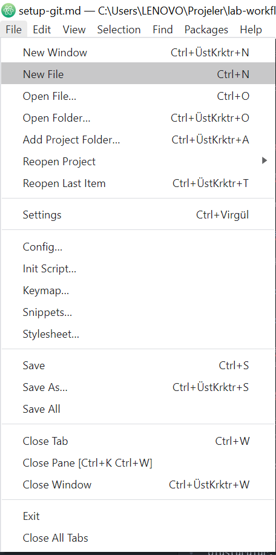
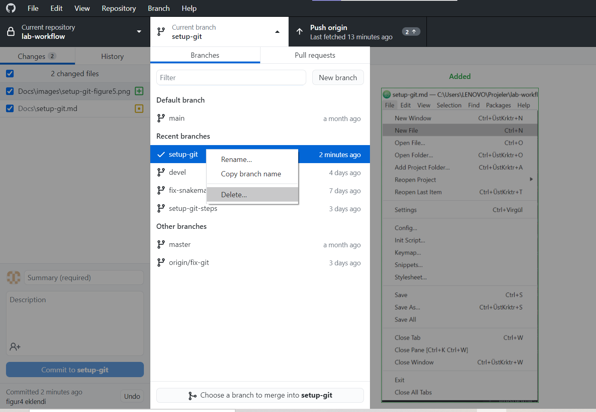
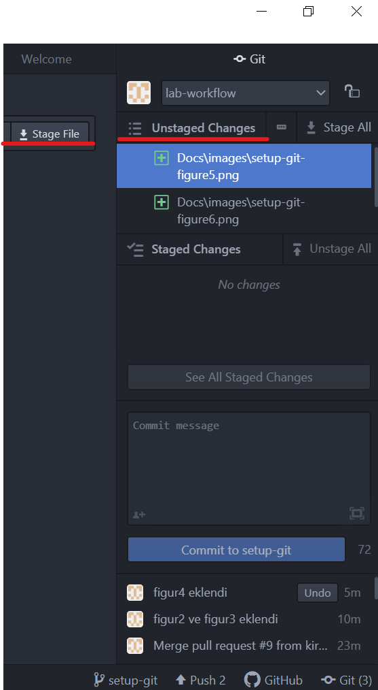
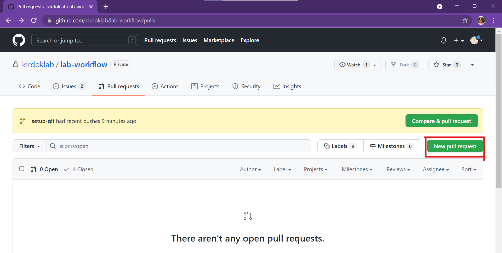
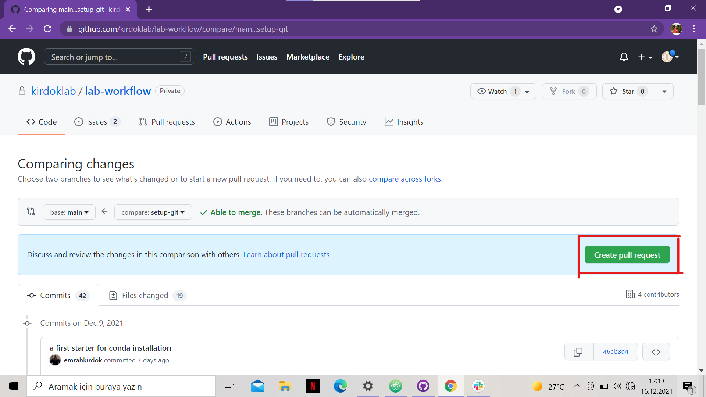
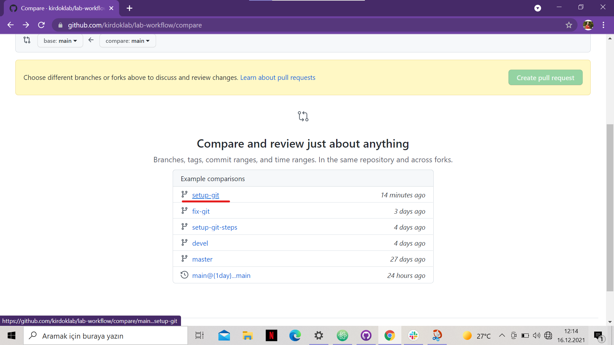

# Installing Git

This document contains the necessary information to set up and work on the Git system.

This document consists of the following titles;

1. What is Github and how to install it?
2. What is Repository?
3. How to clone a repository to computer?
4. How to create a new branch and delete the branch?
5. How to commit the changes made to files? 
6. How to push the changed files? 
7. How to pull the changes found in Github to computer?

## 1. What is Github and how to install it?

Git and Gİthub are different applications. Git tracks changes made in text files and store these changes in a data structure. 

Github on the other hand, is the platform where these changes are kept over the internet. Github must be installed to use this platform.

To install Github, the website [GitHub website] is accessed from (https://desktop.github.com/)

Github can be accessed through  'Atom'. To install this program the website [Atom website] is accessed from (https://atom.io/).

## 2. What is Repository?

The files of the project are stored in the repository. Every document related to the project is stored here.

to start a new project, the steps starting from 'Create a repository' or 'Open a Project' are followed on Github.  

## 3. How to clone a repository to computer?

To save a repository opened on Github to the computer cloning is done. 

+ Open this repository on Github and copy the link from the  ‘Code’ section.

+ Cloning is done by pasting the link from the ‘clone repository’ in the ‘file’ section of Github desktop. 

It is important to know to which file it is cloned. Because all the files of the project will be saved in this folder.  After this process, the repository will be cloned to the computer. 

## 4. How to create a new branch and delete the branch?

There are different branches in Github, such as 'main' and 'devel'.The main branch is always the last available version of the project. The changes are followed through the 'devel' branch. 

When more than one person works on the project, everyone in the project should create their own branches in the devel branch and develop their changes within thsese branches. 

### To create a new branch

+ First the most recent changes are taken by going to the 'devel' branch, then a branch name is written from the  'new branch' section and the branch is created.

+ After coming to the 'Docs' section, a markdown page is opened by selecting 'new file' from the 'File' section. 

+ After adding the desired things to this section, 'Ctrl S' is done to save this branch in the 'Docs' folder. The saved branch can be viewed on Github under the 'Docs' section. Bu 

### To remove a created branch

If a branch is no longer needed after the work is finished it can be deleted by right clicking on the branch from the 'github desktop' and it will be deleted from the 'delete' section.

## 5. How to commit the changes made to files? 

Changes made within the branch must be committed in order to be saved. 

+ After the changes made are saved withn'Ctrl S', the changes made in the 'Unstaged Changes-Docs\' section are checked. 

+ After making the 'stage file', thhe changes made are written in the 'commit message'.

And so the changes are committed. 

## 6. How to push the changed files?

After commiting the changes made on the branch, 'publishing' is done so that other people working on the project can see them. 

If the changes are done on a branch over and over the steps ('Ctrl S' , 'Unstaged Changes-Docs\' ,  'stage file' , 'commit message' , 'publishing') are repeated. 

## 7. How to pull the changes found in Github to computer?

Pull request is used for informing the people working on the project that new changes has been sent to the main repository after the last changes made on the branch.

The branch created by using'Pull request' can be merged with other branches and the 'main' branch.

To make a pull request on GitHub the steps to follow are: 

The branch being worked on is selected in the Pull requests -> New pull request -> Example comparisons 

